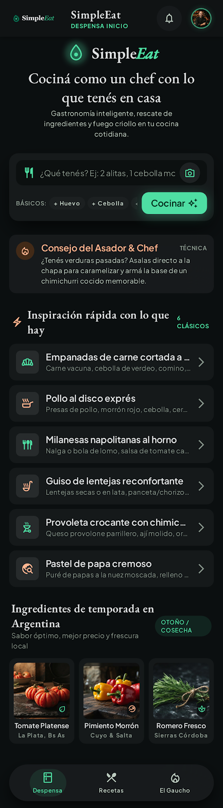
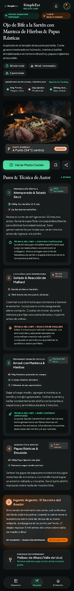
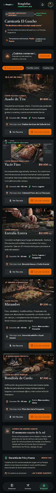

# 🥘 SimpleEat — El chef argentino de tu heladera

> **Un producto de [Vértice](https://github.com/Lucianog13) · Gastronomía argentina · Nodo Paraná**

Escribís lo que tenés en la heladera y **SimpleEat** te dice **qué cocinar** y **cómo**, con técnica de Master Chef y nomenclatura oficial argentina (IPCVA · INTA · GAPA), más el toque regional de Entre Ríos.

**[▶ Probar la demo en vivo](https://lucianog13.github.io/simpleat/)**

---

## 📱 Pantallas

<p align="center">
  
  
  
</p>

| Inicio — Omnibar | Receta — Master Chef | Modo comercio (B2B) |
|:---:|:---:|:---:|

---

## ✨ Qué hace

- **Omnibar de lenguaje natural** — `"2 alitas, 1 cebolla morada"` → receta profesional al instante.
- **📷 Reconocimiento por foto** — sacá una foto de la heladera y detecta los ingredientes (visión con Gemini en la nube, o Ollama local).
- **Master Chef Protocol** — matemática de cocción (`T = Base + Cantidad × Factor`), filtro rápido (< 20 min) y semáforo nutricional.
- **CopingChef · "Ingenio Argento"** — reemplazos "croto pero rico" y hacks técnicos cuando falta algo en la alacena.
- **Nomenclatura oficial argentina** — cortes IPCVA, pescados de río de Entre Ríos, variedades INTA, semáforo GAPA.
- **Estacionalidad** — indicador 🌟 AHORRO y ferias de Paraná.
- **Modo comercio (B2B)** — la app se convierte en la app de una carnicería/verdulería cambiando un solo archivo de perfil.

## 🧠 Cómo funciona

```
Omnibar / Foto → Parser NLP → Motor gastronómico → Receta
                    │                │
            matching greedy   Master Chef + CopingChef
            + cantidades      + semáforo + estacionalidad
```

Todo el motor es **lógica pura en español** (`js/core/`), sin dependencias, con tests.

## 🛠 Stack

| Capa | Tecnología |
|:---|:---|
| Frontend | HTML + CSS + JS vanilla (sin build) |
| Estética | Design system *"Obsidian & Brasas"* (EB Garamond + Plus Jakarta Sans) |
| Reconocimiento (nube) | Supabase Edge Function + Gemini (retry multi-modelo) |
| Reconocimiento (local) | Ollama + llava-phi3 |
| Hosting | GitHub Pages |
| Tests | `node:test` |

## 🚀 Correr local

No necesita build ni servidor:

```bash
# abrí index.html (doble clic), o:
python -m http.server 8000   # → http://localhost:8000
```

Para el reconocimiento por foto en local, se usa Ollama (modelo `llava-phi3`).

## 🧪 Tests

```bash
node --test tests/parser.test.js tests/cocina.test.js
```

## 📁 Estructura

```
index.html                  # SPA (Omnibar → receta)
css/style.css               # Design system "Obsidian & Brasas"
js/data/ingredientes.js     # Diccionario IPCVA/INTA/GAPA
js/data/comercio.js         # Perfil del comercio (modo B2B)
js/core/parser.js           # Parser NLP (puro)
js/core/cocina.js           # Master Chef Protocol (puro)
js/core/coping.js           # CopingChef (puro)
js/ui/app.js                # Capa DOM
supabase/functions/         # Edge Function de visión
tests/                      # node:test
```

---

**Vértice** — software para comercios y gastronomía argentina.
